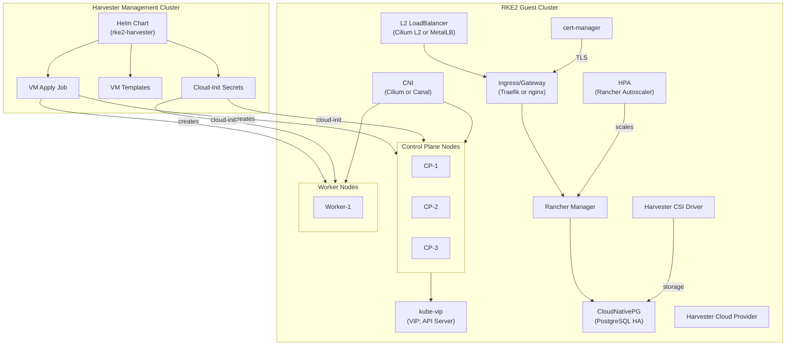
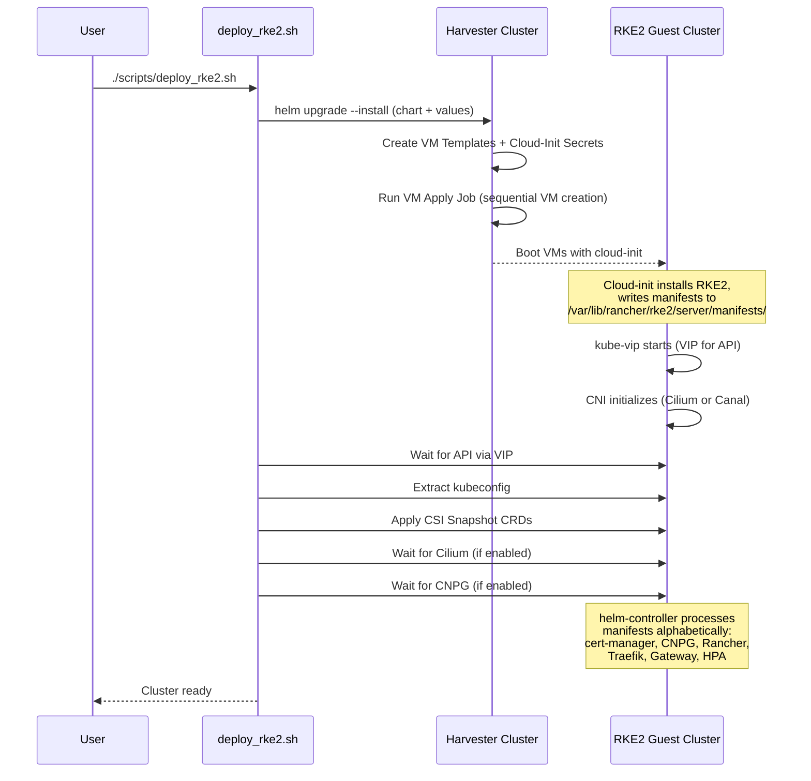
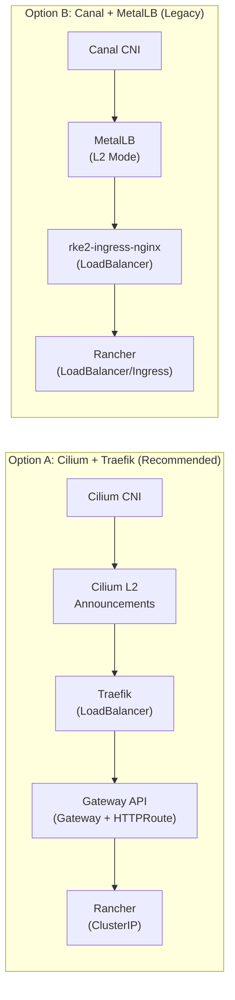

# RKE2 Cluster Automation on Harvester

Automated provisioning of production-grade RKE2 Kubernetes clusters on top of Harvester HCI. A single Helm chart drives VM creation, cloud-init configuration, networking (CNI + L2 load balancing), ingress/gateway, certificate management, Rancher Manager, CloudNativePG, and HPA -- all configured through `custom_values.yaml`.

---

## Architecture Overview



## Deployment Flow



## Networking Stack Options



---

## Features

| Feature | Description | Values Key |
|---------|-------------|------------|
| **Multi-node RKE2** | 3 CP + N workers via Harvester VMs | `replicaCounts.*` |
| **kube-vip** | Control-plane VIP for HA API access | `kubeVip.*` |
| **Cilium CNI** | eBPF-based CNI with kube-proxy replacement | `cilium.*`, `rke2.cni: "cilium"` |
| **Cilium L2 LB** | L2 announcements replacing MetalLB | `cilium.l2.*` |
| **Traefik** | Gateway API controller via HelmChart CRD | `traefik.*` |
| **Gateway API** | Gateway + HTTPRoute for Rancher ingress | `gatewayAPI.*` |
| **MetalLB** | Legacy L2 load balancer (alternative to Cilium) | `metallb.*` |
| **cert-manager** | Automatic TLS certificate management | `certManager.*` |
| **Rancher Manager** | Kubernetes management platform | `rancherManager.*` |
| **CloudNativePG** | HA PostgreSQL for stateless Rancher | `cloudNativePG.*` |
| **Rancher HPA** | Horizontal Pod Autoscaler for Rancher | `rancherHPA.*` |
| **Harvester CSI** | Persistent storage via Harvester volumes | Automatic |
| **Harvester Cloud Provider** | Node lifecycle + LoadBalancer integration | `cloudProvider.*` |
| **Airgap Support** | Private registries, local repos, offline install | `airgap.*` |

---

## 1. Prerequisites

> Run these against the **Harvester management cluster**. Download its kubeconfig from the Harvester UI or use `/etc/rancher/rke2/rke2.yaml` on a Harvester node.

```bash
export KUBECONFIG=/path/to/harvester-kubeconfig
```

1. **Create the guest namespace** (defaults to `rke2`)
   ```bash
   kubectl create namespace rke2
   ```

2. **Seed OS images** (one-time per Harvester cluster)
   ```bash
   kubectl apply -f manifests/image/rocky9.yaml
   kubectl -n harvester-public get virtualmachineimage   # wait until Ready
   ```

3. **Create guest networks and IP pools**
   ```bash
   kubectl apply -f manifests/network/networks.yaml
   kubectl apply -f manifests/network/vmnet-vlan12-ippool.yaml   # requires Harvester DHCP addon
   ```
   See `manifests/network/README.md` for VLAN/bridge details.

4. **Cloud-provider ServiceAccount + RBAC**
   ```bash
   kubectl -n rke2 create serviceaccount rke2-mgmt-cloud-provider
   kubectl create clusterrolebinding rke2-cloud-provider-binding \
     --clusterrole=cluster-admin \
     --serviceaccount=rke2:rke2-mgmt-cloud-provider
   ```

5. **Generate the Harvester CCM kubeconfig**
   ```bash
   curl -sfL https://raw.githubusercontent.com/harvester/cloud-provider-harvester/master/deploy/generate_addon.sh \
     | bash -s rke2-mgmt-cloud-provider rke2
   ```
   Copy the `########## cloud config ############` block into `cloudProvider.cloudConfig` in your values file. If accessing Harvester via IP, set `insecure-skip-tls-verify: true` in the generated kubeconfig.

6. **Bootstrap SSH Secret + RBAC** (required for kubeconfig extraction)
   ```bash
   # Create from template -- fill in your SSH private key
   cp manifests/bootstrap/ssh-key-secret-template.yaml manifests/bootstrap/ssh-key-secret.yaml
   # Edit manifests/bootstrap/ssh-key-secret.yaml with your private key
   kubectl apply -f manifests/bootstrap/ssh-key-secret.yaml
   kubectl apply -f manifests/bootstrap/bootstrap-rbac.yaml
   ```

---

## 2. Configuration

1. **Create your values file**
   ```bash
   cp charts/rke2-harvester/values.yaml custom_values.yaml
   ```

2. **Edit `custom_values.yaml`** -- key sections:

   | Section | Purpose |
   |---------|---------|
   | `replicaCounts` | Number of control-plane and worker VMs |
   | `resources` | CPU/memory per VM role |
   | `image` | Harvester VirtualMachineImage reference |
   | `networks.vm` | VLAN, static IPs, DHCP, MAC addresses |
   | `kubeVip` | Control-plane VIP configuration |
   | `rke2` | Token, version, CNI selection |
   | `cilium` | Cilium CNI + L2 LoadBalancer pools |
   | `traefik` | Traefik gateway controller |
   | `gatewayAPI` | Gateway API CRDs + Rancher Gateway/HTTPRoute |
   | `certManager` | cert-manager + TLS certificates |
   | `rancherManager` | Rancher deployment, hostname, resources |
   | `cloudNativePG` | PostgreSQL HA for Rancher |
   | `rancherHPA` | Horizontal Pod Autoscaler for Rancher |
   | `metallb` | MetalLB L2 (legacy alternative to Cilium L2) |
   | `cloudProvider` | Harvester CCM kubeconfig |
   | `airgap` | Private registries, local repos, offline install |

> **Security**: `custom_values.yaml` contains secrets (tokens, passwords) and is listed in `.gitignore`. Never commit it.

---

## 3. Deployment

### Automated deployment (recommended)

The `deploy_rke2.sh` script handles the full lifecycle:

```bash
./scripts/deploy_rke2.sh
```

The script:
1. Runs `helm upgrade --install` against the Harvester cluster
2. Waits for cloud-init to complete on VMs
3. Extracts the guest kubeconfig via SSH
4. Applies CSI Snapshot CRDs (required before Harvester CSI driver starts)
5. Waits for Cilium readiness (if enabled)
6. Waits for CNPG cluster health (if enabled)
7. Patches CSI driver security context (if needed)

### Manual deployment

1. **Install the Helm chart**
   ```bash
   helm upgrade --install rke2 charts/rke2-harvester \
     -n rke2 --create-namespace \
     -f custom_values.yaml
   ```

2. **Wait for VMs** to reach `Running` status

3. **Extract guest kubeconfig**
   ```bash
   kubectl apply -f manifests/bootstrap/bootstrap-job.yaml
   kubectl -n rke2 logs -f job/rke2-bootstrap
   kubectl -n rke2 get secret rke2-kubeconfig -o jsonpath='{.data.kubeconfig}' | base64 -d > rke2.kubeconfig
   export KUBECONFIG=$PWD/rke2.kubeconfig
   ```

4. **Apply CSI Snapshot CRDs** (before Harvester CSI driver starts)
   ```bash
   kubectl apply -f https://raw.githubusercontent.com/kubernetes-csi/external-snapshotter/v8.3.0/client/config/crd/snapshot.storage.k8s.io_volumesnapshotclasses.yaml
   kubectl apply -f https://raw.githubusercontent.com/kubernetes-csi/external-snapshotter/v8.3.0/client/config/crd/snapshot.storage.k8s.io_volumesnapshotcontents.yaml
   kubectl apply -f https://raw.githubusercontent.com/kubernetes-csi/external-snapshotter/v8.3.0/client/config/crd/snapshot.storage.k8s.io_volumesnapshots.yaml
   ```

5. **Validate the cluster**
   ```bash
   kubectl get nodes
   kubectl -n kube-system get pods
   ```

---

## 4. Networking Stacks

### Option A: Cilium + Traefik + Gateway API (recommended)

Cilium provides both CNI and L2 LoadBalancer functionality, eliminating MetalLB. Traefik serves as the Gateway API controller, replacing rke2-ingress-nginx.

```yaml
rke2:
  cni: "cilium"

cilium:
  enabled: true
  l2:
    enabled: true
    addressPools:
      - name: rancher-vip
        addresses:
          - 172.16.3.6/32        # Single IP, CIDR notation
        autoAssign: false
      - name: general
        addresses:
          - 172.16.3.7/30        # Range via CIDR
        autoAssign: true

traefik:
  enabled: true
  service:
    loadBalancerIP: "172.16.3.6"
    annotations:
      cilium.io/pool: rancher-vip

gatewayAPI:
  enabled: true
  gateway:
    hostname: "rancher.example.com"
```

When Gateway API + Traefik are enabled, Rancher's service type is automatically set to `ClusterIP` (traffic flows through the Traefik Gateway).

### Option B: Canal + MetalLB (legacy)

```yaml
rke2:
  cni: "canal"

metallb:
  enabled: true
  addressPools:
    - name: rancher-vip
      protocol: layer2
      addresses:
        - 172.16.3.6-172.16.3.6
```

---

## 5. Rancher Manager with HA PostgreSQL

For production Rancher deployments, use CloudNativePG for a stateless Rancher architecture that supports HPA:

```yaml
rancherManager:
  enabled: true
  hostname: rancher.example.com
  resources:                          # Required for HPA utilization metrics
    requests:
      cpu: "500m"
      memory: "1Gi"

cloudNativePG:
  enabled: true
  cluster:
    instances: 3                      # 1 primary + 2 replicas
    database: rancher

rancherHPA:
  enabled: true
  minReplicas: 3
  maxReplicas: 7
  metrics:
    cpu:
      averageUtilization: 70
    memory:
      averageUtilization: 80
```

---

## 6. Airgap / Offline Deployment

For environments without internet access, configure the `airgap` section:

```yaml
airgap:
  privateCA: |
    -----BEGIN CERTIFICATE-----
    ...your CA cert...
    -----END CERTIFICATE-----

  registries:
    mirrors:
      docker.io:
        endpoint:
          - "https://registry.internal:5000"
    configs:
      "registry.internal:5000":
        auth:
          username: admin
          password: secret

  systemDefaultRegistry: "registry.internal:5000"
  rke2InstallUrl: "https://repo.internal/rke2/install.sh"

  yumRepos:
    local-baseos:
      name: "Local BaseOS Mirror"
      baseurl: "http://repo.internal/rocky/9/BaseOS/x86_64/os/"
      gpgcheck: false
  disableDefaultRepos: true
```

Each component chart has its own `chartRepo` field (e.g., `rancherManager.chartRepo`, `certManager.chartRepo`) for pointing at internal Helm repos.

---

## 7. Manifest Processing Order

RKE2's helm-controller processes manifests from `/var/lib/rancher/rke2/server/manifests/` alphabetically. The chart uses filename prefixes to control ordering:

| Order | Manifest | Purpose |
|-------|----------|---------|
| 1 | `00-gateway-api-crds.yaml` | Gateway API CRD installation Job |
| 2 | `cert-manager-namespace.yaml` | cert-manager namespace |
| 3 | `cert-manager.yaml` | cert-manager HelmChart |
| 4 | `cilium-config.yaml` | Cilium HelmChartConfig customization |
| 5 | `cnpg-namespace.yaml` | CNPG namespace |
| 6 | `cnpg-operator.yaml` | CNPG operator HelmChart |
| 7 | `harvester-cloud-provider-config.yaml` | Cloud provider + kube-vip config |
| 8 | `kube-vip-rbac.yaml` | kube-vip RBAC |
| 9 | `kube-vip.yaml` | kube-vip DaemonSet |
| 10 | `metallb-*.yaml` | MetalLB (if enabled) |
| 11 | `rancher-*.yaml` | Rancher namespace + HelmChart |
| 12 | `traefik-*.yaml` | Traefik namespace + HelmChart |
| 13 | `zz-cilium-l2.yaml` | Cilium L2 pools (needs Cilium CRDs) |
| 14 | `zz-cnpg-cluster.yaml` | PostgreSQL Cluster CR (needs CNPG CRDs) |
| 15 | `zz-rancher-gateway.yaml` | Gateway + HTTPRoute (needs Gateway API CRDs) |
| 16 | `zz-rancher-hpa.yaml` | HPA for Rancher |

---

## 8. Scaling and Operations

- **Scale up/down**: Change `replicaCounts` and rerun `helm upgrade --install` or `deploy_rke2.sh`.
- **Rolling OS image**: Import a new `VirtualMachineImage`, update `image.name`, rerun Helm.
- **Hooks**: The chart uses two Helm hooks:
  - `post-install/post-upgrade` job: Applies VM manifests sequentially (control-planes first, then workers) and prunes extras.
  - `pre-delete` job: Removes all VMs and PVCs before Helm uninstall.

---

## 9. Cleanup

```bash
# Full teardown
helm uninstall rke2 -n rke2
kubectl delete namespace rke2

# Or use the cleanup script
./scripts/cleanup_rke2.sh
```

Optionally remove cluster-scoped prerequisites:
```bash
kubectl -n harvester-public delete virtualmachineimage rocky-9-cloudimg
kubectl delete -f manifests/network/networks.yaml
kubectl delete -f manifests/network/vmnet-vlan12-ippool.yaml
kubectl delete clusterrolebinding rke2-cloud-provider-binding
kubectl -n rke2 delete serviceaccount rke2-mgmt-cloud-provider
```

---

## Project Structure

```
rke2-cluster-automation/
  charts/rke2-harvester/           # Helm chart
    templates/
      _helpers.tpl                 # Cloud-init, kube-vip, HelmCharts, all templates
      configmap.yaml               # Cloud-init data configmap
      vm-templates.yaml            # Harvester VM templates
      vm-apply-job.yaml            # Post-install hook for VM creation
      vm-cleanup-job.yaml          # Pre-delete hook for VM removal
      ...
    values.yaml                    # Default values (all features)
    Chart.yaml
  scripts/
    deploy_rke2.sh                 # Main automated deployment script
    cleanup_rke2.sh                # Cluster teardown script
    reboot_guest_nodes.sh          # Rolling reboot utility
  manifests/
    bootstrap/                     # SSH key secret + RBAC for kubeconfig extraction
    csi/                           # Harvester CSI driver manifest
    image/                         # Harvester VirtualMachineImage definitions
    network/                       # VLAN networks and IP pools
  custom_values.yaml               # Your environment config (gitignored)
```

---

## Security Notes

- `custom_values.yaml`, `rke2.kubeconfig`, SSH key secrets, and TLS keys are all listed in `.gitignore` and must never be committed.
- The `manifests/bootstrap/ssh-key-secret-template.yaml` file is a safe template with empty placeholders. Copy it to `ssh-key-secret.yaml` (gitignored) and fill in your private key.
- The `manifests/rancher/tls-secret.yaml` file contains placeholder comments, not real certificates.
- For airgap deployments with private CAs, set `airgap.privateCA` to automatically inject `tls.ca_file` into all registry configurations.

---

## Known Issues

- **Harvester v1.6.1 DHCP bug**: MAC addresses change on VM restart, breaking DHCP reservations. Workaround: use the dev build of `harvester-vm-dhcp-controller` (see `manifests/network/README.md`).
- **CSI driver CrashLoopBackOff**: VolumeSnapshot CRDs must be applied before the Harvester CSI driver chart is processed. The `deploy_rke2.sh` script handles this automatically.
- **Cloud-init `systemctl start` timeout**: RKE2's Type=notify service may timeout on first boot. The chart appends `|| true` and includes a health-check loop so cloud-init succeeds even when the initial start returns non-zero.
